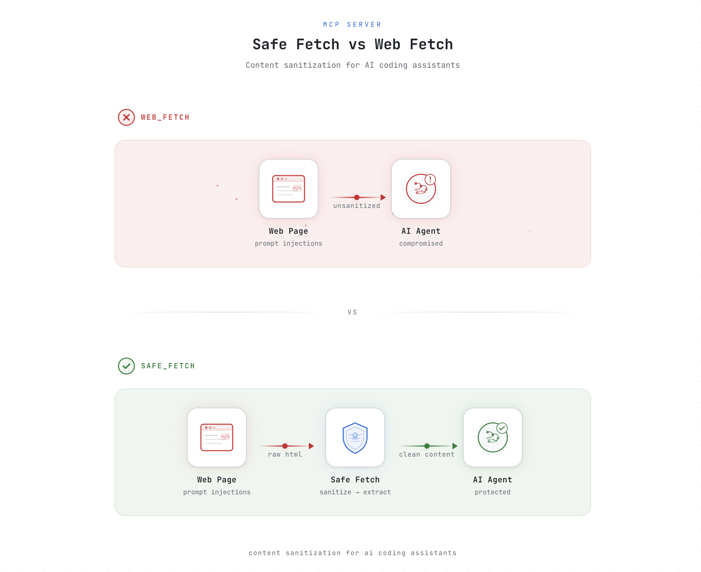

<picture>
  <source media="(prefers-color-scheme: dark)" srcset="assets/banner-dark.png">
  <source media="(prefers-color-scheme: light)" srcset="assets/banner-light.png">
  
</picture>

# mcp-safe-fetch

Deterministic content sanitization MCP server for agentic coding tools. Strips prompt injection vectors from web-fetched content before it enters the LLM context.

Drop-in replacement for Claude Code's built-in `WebFetch` — exposes a `safe_fetch` tool that fetches URLs, sanitizes the HTML, and returns clean markdown.

## Why

WebFetch dumps raw page content into your context window — JavaScript bundles, CSS, hidden elements, and all. That means:

- **Wasted tokens**: a single Node.js docs page costs ~75K tokens through WebFetch vs ~2K through safe_fetch (97% reduction)
- **Injection risk**: hidden `display:none` text, fake LLM delimiters, and encoded payloads pass straight through to Claude
- **Worse results**: Claude parses through React hydration scripts instead of focusing on the actual content

## What it strips

**HTML-level:**
- Hidden elements — `display:none`, `visibility:hidden`, `opacity:0`, `[hidden]`
- Off-screen elements — `position:absolute; left:-9999px`, `clip:rect(0,0,0,0)`, `font-size:0`
- Same-color text — `color:white; background:white` (inline styles, ~20 named colors + hex + rgb)
- Dangerous tags — `<script>`, `<style>`, `<noscript>`, `<meta>`, `<link>`
- HTML comments

**Character-level:**
- Zero-width chars, soft hyphens, BOM, bidi overrides, variation selectors, tag characters
- Control characters (preserves `\n`, `\t`, `\r`)
- NFKC normalization (collapses fullwidth and homoglyph characters)

**Encoded payloads:**
- Base64 strings that decode to instruction-like text
- Hex-encoded instruction sequences
- Text data URIs

**Structural injection:**
- Fake LLM delimiters — `<|im_start|>`, `[INST]`, `<<SYS>>`, `\n\nHuman:`, etc.
- Markdown image exfiltration URLs — ``
- Custom user-defined patterns

## Real-world results

Tested against 4 live sites:

| Site | WebFetch tokens (est.) | safe_fetch tokens | Reduction | Threats caught |
|------|----------------------|-------------------|-----------|----------------|
| PayloadsAllTheThings | ~39,500 | ~7,800 | 80% | 3 hidden elements, 4 LLM delimiters |
| FotMob news article | ~109,500 | ~5,900 | 95% | 32 script tags, 90 style tags |
| Node.js docs | ~75,500 | ~2,100 | 97% | 2 hidden elements, 1 off-screen |
| Express.js | ~9,400 | ~1,400 | 86% | Clean page |

**93% average token reduction. Zero false positives.** All visible page content preserved.

## Install

```bash
npx -y mcp-safe-fetch init
```

This configures Claude Code to use `safe_fetch` and deny the built-in `WebFetch`. Restart Claude Code after running.

## Usage

### As MCP server (automatic)

After `init`, Claude Code uses `safe_fetch` whenever it needs to read a URL. The sanitization header shows what was stripped:

```
[safe-fetch] Stripped: 5 hidden elements, 2 off-screen elements, 68 script tags | 284127 → 12720 bytes (219ms)
```

### CLI

Test sanitization on any URL:

```bash
npx -y mcp-safe-fetch test <url>
```

View aggregated stats from logged sanitization runs:

```bash
npx -y mcp-safe-fetch stats
```

### MCP tools

| Tool | Description |
|------|-------------|
| `safe_fetch` | Fetch a URL and return sanitized markdown |
| `sanitize_stats` | Show session sanitization statistics |

## Configuration

Optional. Create `.mcp-safe-fetch.json` in your project root or home directory:

```json
{
  "logStripped": true,
  "logFile": ".claude/sanitize.log",
  "allowDataUris": false,
  "maxBase64DecodeLength": 500,
  "customPatterns": ["IGNORE ALL PREVIOUS"]
}
```

| Option | Default | Description |
|--------|---------|-------------|
| `logStripped` | `false` | Log sanitization stats to JSONL file |
| `logFile` | `.claude/sanitize.log` | Log file path |
| `allowDataUris` | `false` | Allow text/* data URIs through |
| `maxBase64DecodeLength` | `500` | Max base64 string length to decode and inspect |
| `customPatterns` | `[]` | Literal strings to strip (case-insensitive) |

## How it works

1. Fetch URL with native `fetch`
2. Parse HTML with [cheerio](https://cheerio.js.org/)
3. Strip hidden elements, off-screen elements, same-color text, dangerous tags, comments
4. Convert to markdown with [turndown](https://github.com/mixmark-io/turndown)
5. Strip invisible unicode characters, normalize with NFKC
6. Detect and remove encoded payloads (base64, hex, data URIs)
7. Detect and neutralize exfiltration URLs in markdown images
8. Strip fake LLM delimiters and custom patterns

## License

MIT
